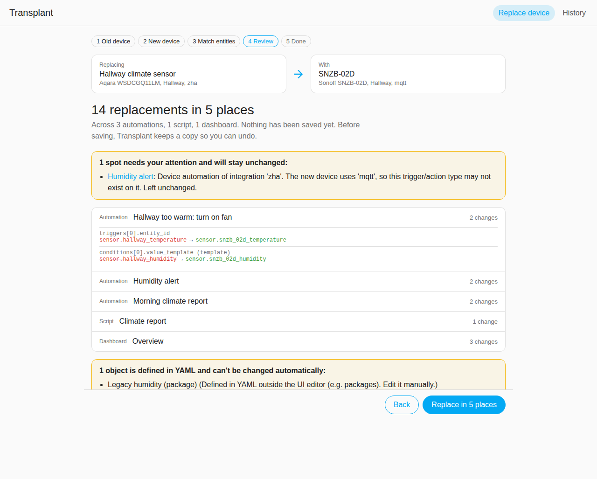
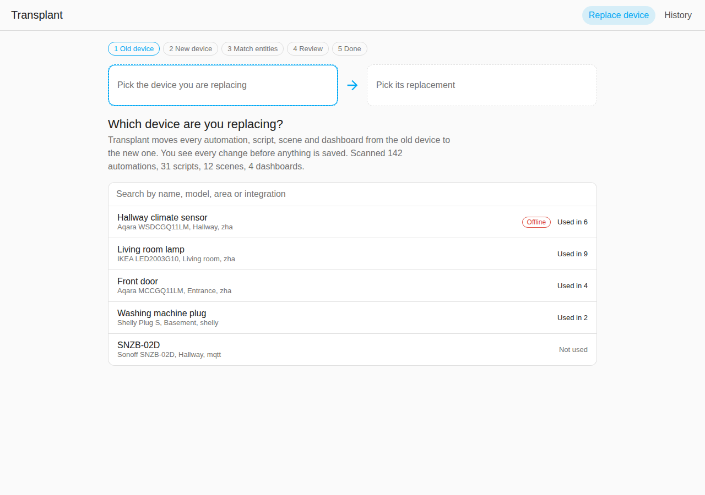
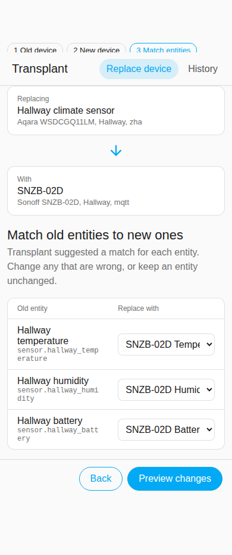
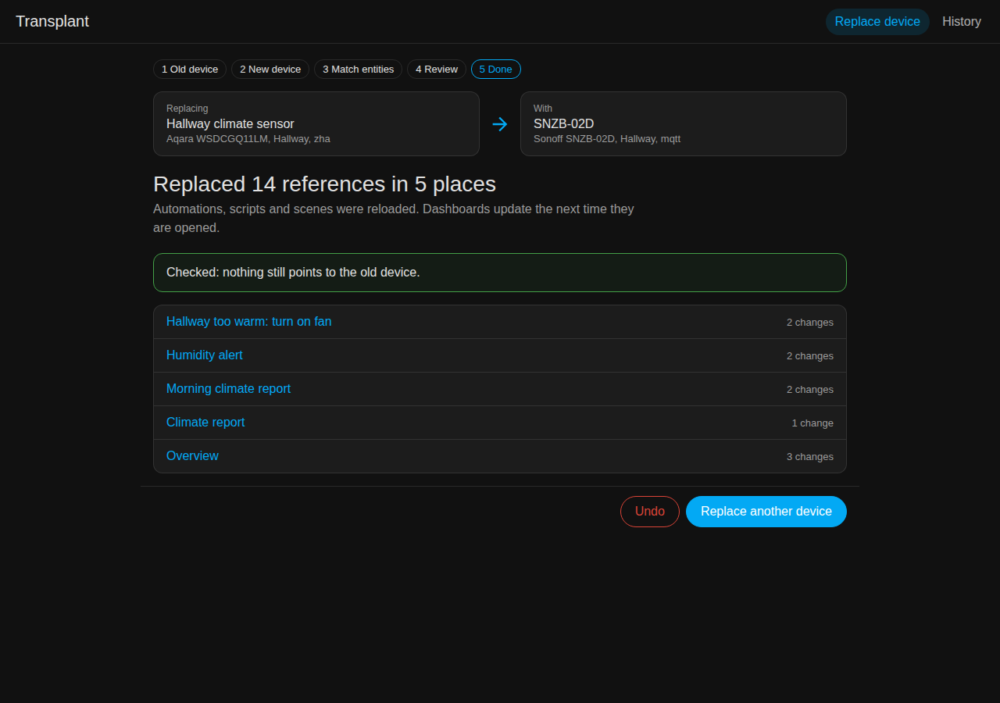

# Transplant

**Replace a broken device in Home Assistant without breaking anything.**
Pick the old device, pick the new one, review every change, apply. Undo any time.

## Why?

A sensor dies, you pair a new one, and it arrives with new entity IDs and a new device ID.
Now every automation, script, scene and dashboard that used the old one is quietly broken,
and fixing it means hunting through YAML by hand.

Home Assistant can *tell* you something is missing (Repairs, Spook, Watchman).
Transplant *moves* it: one device to another, across all of your configuration, with a preview first.

## Features

- **See where a device is used** – automations, scripts, scenes and dashboards, before you change anything.
- **Automatic entity matching** – temperature goes to temperature, battery to battery. Fix any match in a dropdown.
- **Exact preview** – every single replacement with its location, including inside templates.
- **Safe apply** – checks nothing changed since the preview, validates with Home Assistant's own validators, keeps a copy, reloads, then re-scans to confirm.
- **Undo** – restores everything you haven't edited since.

Works across brands and integrations (e.g. a ZHA sensor replaced by a Zigbee2MQTT one).
Integration-specific device triggers that cannot be moved safely are listed for you instead of being changed.

## Installation

### HACS (recommended)

1. HACS → ⋮ → **Custom repositories** → add `https://github.com/Meyersbu/ha-transplant`, type **Integration**.
2. Install **Transplant** and restart Home Assistant.
3. **Settings → Devices & services → Add integration → Transplant**.

### Manual

Copy `custom_components/transplant` from the [latest release](https://github.com/Meyersbu/ha-transplant/releases) into your `config/custom_components/`, restart, then add the integration.

## Usage

Open **Transplant** in the sidebar (administrators only):

1. Choose the device you are replacing. Offline devices are listed first.
2. Choose the new device. Same area and newest devices come first.
3. Check the suggested entity matches.
4. Review the changes and select **Replace in N places**.
5. Done. **Undo** is right there, and under **History** later.

| Pick a device | Match entities (mobile) | Done (dark theme) |
|---|---|---|
|  |  |  |

## What it changes, and what it doesn't

| Where | Read | Changed |
|---|---|---|
| Automations, scripts, scenes made in the UI (`automations.yaml`, `scripts.yaml`, `scenes.yaml`) | ✅ | ✅ |
| Dashboards in UI (storage) mode | ✅ | ✅ |
| YAML packages, YAML-mode dashboards | ✅ | Listed for manual editing |
| Entity history and statistics | – | Not in 0.1 ([roadmap](#roadmap)) |

Transplant never edits the device or entity registry and never touches the database.

## How it works

A custom integration scans your configuration once into a reverse index
(*which object uses which ID*), plans replacements as a pure transformation,
and exposes admin-only WebSocket commands to a sidebar panel.
Writes go through the same files and reload services as Home Assistant's own editors.
Details: [docs/architecture.md](docs/architecture.md).

## Roadmap

- **0.2** Replace a single entity, helpers (groups, template/threshold/utility meter sources), YAML patch export
- **0.3** Faster scans on very large installs, keyboard-first UX, more languages
- **0.5** Keep history and long-term statistics when swapping
- **1.0** Stable WebSocket API and full documentation

## Contributing

Contributions are welcome. Start with [CONTRIBUTING.md](CONTRIBUTING.md) and the
[`good first issue`](https://github.com/Meyersbu/ha-transplant/labels/good%20first%20issue) label.

MIT licensed.
