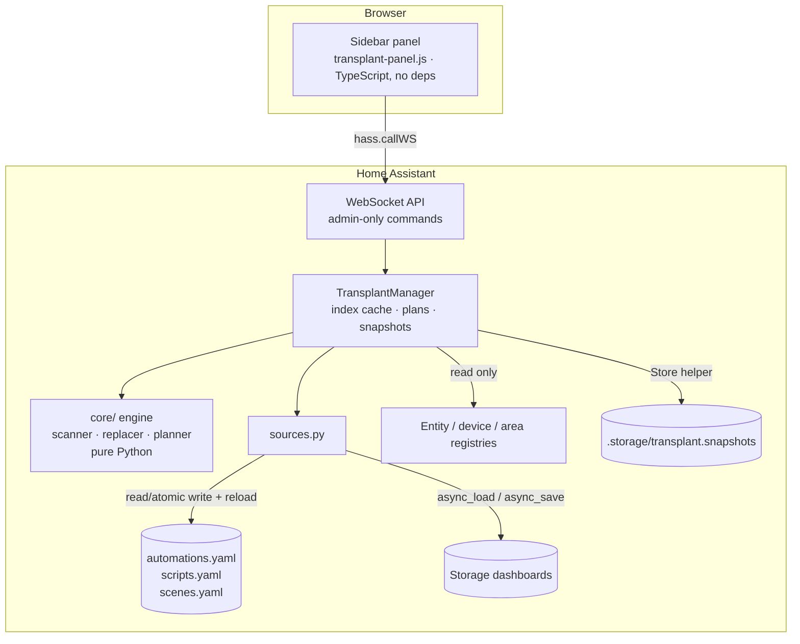

# Architecture

## Components

| Component | Language | Job | Talks to |
|---|---|---|---|
| `core/` | Python, no HA imports | Find references, rewrite configs, match entities, build plans | Nothing (pure) |
| `sources.py` | Python | Load/save automations, scripts, scenes, dashboards | Config files, Lovelace dashboard objects |
| `manager.py` | Python | Cache the index, keep plans (15 min TTL), apply with rollback, snapshots, undo | Registries, `Store`, services |
| `websocket.py` | Python | Validated, admin-only commands | Manager |
| Panel | TypeScript | Wizard UI | `hass.callWS` |

Data flow for one swap: `overview` → `device_usage` → `suggest` → `preview` (server keeps the plan) → `apply(plan_id)` → `undo(snapshot_id)`.

## Feasibility (checked against Home Assistant `dev`, Oct 2026, and tested on 2025.1)

| Capability | Status | How |
|---|---|---|
| List devices/entities/areas | SUPPORTED | Device, entity and area registry helpers |
| Read UI automations/scripts/scenes | SUPPORTED | Same YAML files the core config editor reads |
| Write UI automations/scripts/scenes | SUPPORTED | `homeassistant.util.yaml.dump` + `write_utf8_file_atomic` + `<domain>.reload`, identical to the core editor |
| Validate before writing | SUPPORTED | `automation.config.async_validate_config_item`, `script.config.async_validate_config_item` |
| Read YAML/package automations and scripts | PARTIALLY | `raw_config` on the automation/script entities; read-only by design |
| Read/write storage dashboards | PARTIALLY | Lovelace dashboard objects (`async_load`/`async_save`). Not a documented public API, but stable for years and used by Spook. Accessed defensively; failures only skip dashboards |
| Keep entity history across a swap | UNSUPPORTED for 0.1 | Renaming entity IDs makes the recorder migrate history *with the old entity*. Needs a dedicated, tested strategy (roadmap 0.5) |
| Change device triggers across integrations | UNSUPPORTED (safely) | Trigger types are integration-specific. Flagged for manual review instead |

No monkey patching, no core modification, no database access, no DOM manipulation of the HA frontend.

## Data model

- `ConfigSource(source_type, source_id, name, config, editable, entity_id, read_only_reason)`
- `Reference(source_type, source_id, target_type, target_id, path, kind)` where `target_type` ∈ entity, device, entity_registry_id and `kind` ∈ value, key, template
- `Replacements(entities, devices, entity_registry_ids, old_integration, new_integration)`
- `ItemPlan(source, updated_config, changes[], review[])`, `Plan(items, fingerprints)`

**Cache and invalidation.** One scan builds `ReferenceIndex` (hash map target → references), so lookups are O(1) and a full scan is O(size of configuration). The cache is dropped on entity/device registry updates, `lovelace_updated`, `automation_reloaded`, any `script/scene/automation.reload` call, and after 120 s. `preview` always rescans.

**Stale protection.** Each planned object gets a SHA-256 fingerprint at preview time. `apply` re-reads it from disk and aborts if anything changed.

## Why references are matched by value

Home Assistant's schemas move (`trigger` → `triggers`, `service` → `action`), and custom cards use arbitrary keys. The scanner therefore matches *values* against the set of IDs that exist, instead of parsing each schema. Device and registry IDs are 32-character hex strings, so false positives are practically impossible. Entity IDs inside templates are matched as whole tokens (`light.kitchen` never matches `light.kitchen_2`), including the `states.light.kitchen` form. Entity IDs assembled at runtime in templates cannot be found statically. This is a documented limitation.
